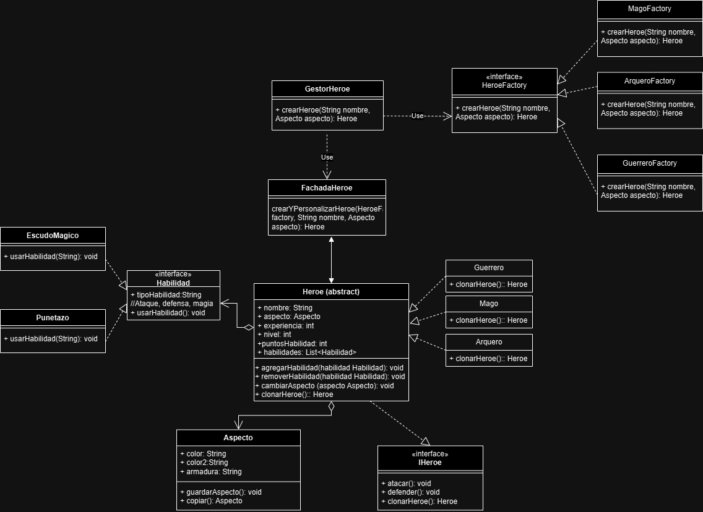
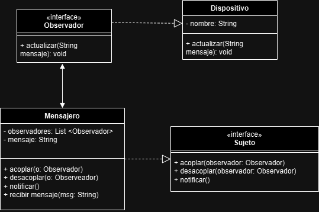

# PATRONES DE DISEÑO

Integrantes:  
Daniel Pareja y Juan Felipe Gomez

  

# Problema 1

Solucion:
 
Prototype
 
Factory Method
 
Facade
 

# Problema 2

Solucion: 
Observer

 

# Problema 3

Solucion:  
Template Method

# Problema 4

Solucion:
